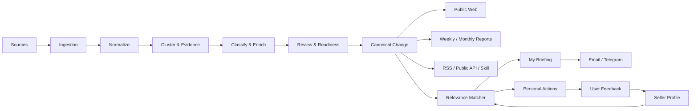

# TradeLinks Phase 1 Product Structure — Public Intelligence + Personal Relevance — Design

**Status:** Approved by Human Owner  
**Date:** 2026-07-23  
**Revision:** 1  
**Human Owner:** xtation  
**Scope:** Product strategy, information architecture, data architecture, readiness gates, distribution, monetization, delivery milestones, and verification for TradeLinks Phase 1  
**Implementation:** Not part of this document. A separate implementation plan is required after Human Owner review.

## Executive summary

TradeLinks will transition from a cross-border news and trend portal into a tool that helps global English-speaking sellers understand and operate in a specified market.

The long-term product is deliberately split into two products or major phases:

1. **TradeLinks Intelligence — Phase 1:** a public market-intelligence layer plus a free personal relevance and action layer.
2. **TradeLinks Operator — Phase 2:** an agent that helps sellers open and operate stores, using Phase 1's evidence, market knowledge, seller context, and action history.

This document specifies Phase 1 only.

Phase 1 targets global English-speaking sellers who are exploring, preparing to enter, or already operating in the United States through **Amazon**, **Shopify**, or both. It helps them answer:

- What changed in the US market or on my platform?
- Which changes are relevant to my business?
- Why are they relevant?
- What should I review or do next?
- What evidence supports the conclusion?

Phase 1 does not promise autonomous execution, exhaustive global coverage, or reliable "next bestseller" prediction.

The core product model is:

```text
Explore → Monitor → Act
```

- **Explore:** understand the US market, platforms, product categories, policies, compliance requirements, and demand context.
- **Monitor:** receive changes matched to a simple Seller Profile.
- **Act:** save, dismiss, create, track, and complete actions grounded in verified evidence.

The business model starts with public content and a complete free personalized experience. A $5–15/month Plus tier is introduced only after relevance and retention are validated. Google Ads are optional and considered later based on stable content operations, organic traffic, conversion impact, and expected revenue.

## Product decisions

The following decisions were confirmed during product design:

- Primary customer: individual sellers and small cross-border seller teams.
- Primary language: English.
- Initial destination market: United States.
- Initial platforms: Amazon and Shopify.
- Primary paid problem: understand which external changes affect the seller and what action to take.
- Secondary core problem: help a new seller understand a market, platform, and product category before entering.
- Phase 1 structure: public intelligence plus private relevance and action.
- Phase 2 structure: store-launch and store-operations agent, specified separately.
- Phase 1 north-star metric: active users with a completed Seller Profile who receive and interact with relevant actionable intelligence.
- P0 reliability gate: seven consecutive days of stable production collection.
- Product trends are not a primary Phase 1 promise.
- Product category is a first-class classification and personalization dimension.
- Seller Profile excludes manually configured risk attributes and notification cadence.
- Free public RSS and future Plus pricing do not conflict: RSS distributes public facts, while Plus sells personalized impact, speed, and action management.
- Initial distribution priority: Email, public RSS, Telegram, public Agent Skill/API.
- Initial monetization order: public content and free personalization, then Plus, then optional Google Ads.

## Why the product must change

The existing product has useful building blocks:

- source registry and ingestion pipeline;
- AI categorization, scoring, deduplication, and summaries;
- human review;
- alerts with action-oriented fields;
- daily notes;
- Amazon best-seller snapshots;
- Telegram and email infrastructure;
- source health inspection;
- public RSS and API routes.

However, these capabilities are currently presented as parallel editorial tracks such as Wire, Radar, and Daily. That structure makes the product feel like a media destination rather than a seller tool.

More importantly, production readiness does not yet support every product promise:

- A production patrol for 2026-07-22 showed 36 active sources but zero sources producing items in the window.
- All active sources reported their last successful check on 2026-07-02.
- The 2026-07-22 window contained zero items, alerts, daily notes, product snapshots, trend snapshots, and pushes.
- The final active day inspected, 2026-07-02, produced 483 items, 14 alerts, two daily notes, 120 product snapshots, and 44 trend snapshots.
- On that active day, 71% of alerts included North America.
- The product-snapshot pipeline produced zero qualified movers.
- Product commodity classification was absent for the inspected snapshots.
- Direct sources for Google Trends, TikTok Creative Center, Reddit, Mercado Libre, Temu, Noon, AliExpress, and X were inactive.
- Distribution had one confirmed subscriber.

Therefore, content production is partially proven, while always-on reliability, category-specific compliance coverage, personalized relevance, retention, and commercial willingness remain unproven.

## Long-term product decomposition

### Product 1: TradeLinks Intelligence

Phase 1 solves:

> What is changing in the US market, on Amazon, or on Shopify; does it affect me; and what should I do next?

It includes:

- public market, platform, category, policy, and change pages;
- canonical evidence-backed changes;
- source and capability readiness;
- simple Seller Profiles;
- personalized My Briefing;
- personal actions;
- weekly email;
- public RSS;
- later public API, Agent Skill, and Telegram;
- later low-price Plus.

### Product 2: TradeLinks Operator

Phase 2 solves:

> I want to enter or operate in the US market. What should happen next, and which tasks can an agent prepare or execute for me?

Its conceptual entry paths are:

- **Start a new store**
- **Grow my store**

It may later include:

- market-entry diagnosis;
- launch roadmap and task decomposition;
- document and listing preparation;
- store, advertising, and operating connectors;
- user-approved execution;
- long-running agent work;
- subscription and usage pricing.

Phase 2 is not part of the Phase 1 implementation plan. It gets its own product specification after Phase 1 has produced reliable intelligence, seller context, and evidence of user demand.

## Positioning

### Product statement

> TradeLinks is a US market intelligence and action tool for global English-speaking Amazon and Shopify sellers. It explains market and platform changes, determines which changes are relevant to the seller, and turns verified intelligence into manageable next actions.

### What TradeLinks is not in Phase 1

- Not a generic cross-border news aggregator.
- Not a global all-market coverage product.
- Not an autonomous store operator.
- Not a legal, tax, customs, or regulatory adviser.
- Not a guaranteed product-demand or bestseller predictor.
- Not a replacement for official platform and government sources.

## North-star metric

The north-star metric is **Weekly Relevant Seller Profiles**.

A Seller Profile qualifies during a rolling seven-day period when:

1. the profile is complete;
2. the system delivers at least one qualified relevant Canonical Change;
3. the user opens, saves, dismisses, creates an action from, or completes an action related to at least one delivered change.

This metric prevents page views, registrations, empty profiles, and automatically generated emails from being mistaken for product value.

Supporting metrics are:

- organic entries to public market, platform, category, guide, and change pages;
- public-to-profile conversion;
- profile completion;
- percentage of profiles receiving at least one relevant item per week;
- irrelevant-dismissal rate;
- save, create-action, and completion rates;
- weekly and four-week retention;
- email open and click-through rates;
- future Plus waitlist and paid conversion;
- future advertising revenue and its effect on profile conversion.

## User model

### Primary users

Global English-speaking individual sellers and small teams that:

- are exploring the US market;
- are preparing to launch in the US;
- already sell in the US;
- use Amazon, Shopify, or both;
- need to monitor policies, compliance, logistics, and category-specific changes;
- do not have a dedicated compliance or market-intelligence team.

### Operating stages

- **Exploring the US market:** content emphasizes entry requirements, major constraints, category fit, and whether the opportunity deserves further work.
- **Preparing to launch:** content emphasizes documentation, restrictions, platform setup, and pre-launch checks.
- **Already selling:** content emphasizes impact, effective dates, risk, and immediate or scheduled action.

The same Canonical Change can produce different relevance explanations for each stage.

## Product structure

### Explore

Public, search-indexable knowledge helps new and existing sellers understand:

- the US market;
- Amazon US;
- Shopify in the US;
- major product categories;
- compliance and risk topics;
- recent verified changes;
- weekly and monthly market patterns.

### Monitor

A signed-in user receives My Briefing based on:

- operating stage;
- US market;
- platform;
- product categories.

Each briefing item explains:

- what changed;
- why it matters;
- why it is relevant to this profile;
- when it takes effect;
- readiness and confidence;
- evidence;
- a recommended next step.

### Act

A relevant change can be:

- opened;
- saved;
- dismissed as irrelevant;
- converted into an action;
- marked complete.

These interactions improve future relevance and provide the seed context for Phase 2.

## Public information architecture

The public product should contain:

- **US Market**
- **Amazon US**
- **Shopify US**
- **Categories**
- **Changes**
- **Guides**
- **Briefings**
- **Coverage & Readiness**

### US Market

Summarizes:

- customs and import conditions;
- federal product and consumer regulation;
- logistics;
- tax and payments context;
- demand context when sufficiently ready;
- major current changes.

### Amazon US

Summarizes:

- official seller-policy changes;
- fees;
- category restrictions;
- account and listing implications;
- category-specific compliance;
- Amazon demand signals marked by readiness.

### Shopify US

Summarizes:

- platform changelog and product changes;
- payments, privacy, tax, and application ecosystem;
- store-operation implications;
- category-specific selling considerations;
- demand context when reliable sources exist.

### Changes

The default view is **Verified Changes**.

An optional **All Monitored Changes** view supports search and expert filtering but still excludes:

- unreviewed content;
- low-relevance noise;
- merged duplicates;
- inaccessible or disallowed content;
- unsupported conclusions.

Experimental demand signals remain visibly separate.

### Guides

Evergreen, evidence-backed guides explain:

- market-entry concepts;
- platform rules;
- category requirements;
- risk and compliance topics;
- recurring seller tasks.

Guides must link to their sources and indicate their last review date.

### Briefings

- **Live Changes:** continuously updated verified stream.
- **Public Weekly Briefing:** primary public report.
- **Monthly US Market Review:** synthesized market and platform review.
- **Daily Briefing:** produced only when content clears a quality threshold; no obligation to manufacture a daily report.
- **My Weekly Briefing:** free personalized report.
- **Daily or Instant Alerts:** future Plus feature.

## Reframing existing Wire, Radar, and Daily

- **Wire** becomes **Changes**, containing policy, platform, logistics, and other verified market changes.
- **Radar** becomes **Demand Signals** inside the relevant market, platform, and category context. It remains Experimental until evidence gates are met.
- **Daily** becomes the Briefing family. Weekly is the primary report because TradeLinks has lower qualified signal volume than a general technology-news product.

These are no longer parallel top-level product identities.

## Canonical content model

The core content chain is:

```text
Source
  → Source Item
  → Evidence Cluster
  → Canonical Change
  → Relevance Assessment
  → Personal Action
```

### Canonical Change

A Canonical Change contains:

- stable ID and permalink;
- version;
- title;
- summary;
- Signal Type;
- market and regions;
- platforms;
- Product Categories;
- content-side Risk Attributes;
- published date;
- effective date when known;
- urgency;
- readiness;
- primary official evidence;
- supporting evidence;
- general impact explanation;
- general recommended-action template;
- editorial status;
- created, reviewed, and updated timestamps.

The public website, reports, RSS, email, API, and Agent Skill consume this same object.

### Evidence

Evidence is structured, not a URL array. Each evidence record contains:

- source identity;
- URL;
- role: primary official, supporting official, or secondary context;
- published date;
- authority level;
- access and licensing constraints;
- relevant excerpt or normalized evidence summary;
- fetch and review timestamps.

An official update or retraction creates a new Canonical Change version. Existing personal actions retain the source version they were created from and receive a review warning when the underlying conclusion changes.

## Signal Type, Product Category, and Risk Attribute

These concepts must not share one `category` field.

### Signal Type

Signal Type answers:

> What kind of change is this?

Initial values:

- regulatory;
- platform policy;
- logistics;
- demand;
- industry;
- practical guidance.

### Product Category

Product Category answers:

> Which products does this affect?

The stable Level 1 taxonomy is:

- All Products
- Consumer Electronics
- Pet Supplies
- Beauty & Personal Care
- Toys & Children's Products
- Home & Kitchen
- Apparel & Accessories
- Health & Supplements
- Food & Beverage
- Sports & Outdoors
- Automotive & Tools

### Initial public Category Hubs

The first six Category Hubs are:

1. Consumer Electronics
2. Pet Supplies
3. Beauty & Personal Care
4. Toys & Children's Products
5. Home & Kitchen
6. Apparel & Accessories

The remaining categories exist in the taxonomy but become public only when their coverage reaches Monitored.

### Risk Attributes

Risk Attributes are content-side classification used for evidence review, category guidance, and action templates:

- Battery
- Wireless / Radio
- Children
- Ingestible
- Topical / Cosmetic
- Food Contact
- Medical Claim
- Animal Health
- Chemical / Hazmat
- Textile / Labeling
- Electrical Safety

Risk Attributes are not manually configured in the Phase 1 Seller Profile. Phase 2 may infer them from connected products or listings.

## Category Hub content

Each ready Category Hub contains:

- category overview;
- relevant US regulatory bodies;
- import, labeling, and safety requirements;
- Amazon category restrictions;
- Shopify selling considerations;
- common risk attributes;
- recent verified changes;
- demand signals only when ready;
- a `Track this category` call to action.

Category Hubs are lenses over shared Canonical Changes, not separate editorial databases.

## Seller Profile

The Phase 1 Seller Profile is deliberately simple:

- operating stage;
- market, fixed to the United States;
- platform: Amazon, Shopify, or both;
- up to two Product Categories.

Email and account identifiers belong to the identity system, not the Seller Profile.

Notification cadence does not belong to the Seller Profile. Free users receive the weekly briefing by default. Future Plus cadence and channel settings belong to a separate Subscription Settings model.

Phase 1 does not request:

- store credentials;
- Amazon or Shopify OAuth;
- order data;
- product catalogs;
- advertising data;
- manually selected risk attributes.

## Onboarding

The onboarding model is **profile-first preview, then registration**.

### Step 1: operating stage

- Exploring the US market
- Preparing to launch
- Already selling

### Step 2: platform

- Amazon
- Shopify
- Both

### Step 3: Product Categories

The visitor selects up to two supported categories.

### Preview

Before registration, the visitor receives:

- three to five recent relevant changes;
- relevance explanations;
- readiness labels;
- at least one example next action;
- an example weekly briefing.

The visitor then provides an email address and uses a Magic Link to save the profile and receive the free product.

### Signed-in minimum navigation

- My Briefing
- Actions
- Watchlist
- Profile

## Relevance model

Phase 1 matching uses:

```text
Market
× Platform
× Product Category
× Operating Stage
× Urgency
```

Each Relevance Assessment records:

- profile ID;
- Canonical Change ID and version;
- relevance score;
- matched dimensions;
- plain-language explanation;
- recommended next step;
- generated and reviewed timestamps;
- user feedback state.

The UI must explain the match. It must not show only an opaque score.

Content-side Risk Attributes can support editorial classification and action templates, but are not required Seller Profile inputs.

## Personal actions

A Canonical Change carries a general action template, such as:

> Check whether products containing lithium batteries comply with the updated labeling requirement.

A Personal Action is created only when the user selects `Create Action`.

It records:

- Seller Profile ID;
- Canonical Change ID and version;
- title and description;
- due date when evidence supports one;
- status: open, complete, or archived;
- completion note;
- created and updated timestamps.

Phase 1 does not execute an action on an external service.

## Readiness model

### User-visible levels

| Level | Meaning | Allowed behavior |
|---|---|---|
| Unavailable | No stable source or the capability is broken | Do not include in product promises |
| Experimental | Data exists but history, coverage, or accuracy is insufficient | Show only in clearly labeled exploration surfaces |
| Monitored | Source operates consistently and coverage limits are explicit | Use in public explanations and general briefing |
| Verified | Authoritative, fresh, evidenced, and reviewed | Use for personalized impact and action templates |
| Stale | Previously usable but currently overdue | Preserve history, suppress new actions |

### Capability rules

```text
Public market explanation: Monitored or better
Personal relevance notification: critical sources Verified
Action recommendation: Verified + reviewed action template
Phase 2 external execution: Verified + deterministic connector + user approval
```

### P0 reliability gate

Before launching the redesigned product:

- scheduling and collection operate for seven consecutive days;
- no global collection gap exceeds its SLA;
- each source has a freshness SLA;
- fetch failure, content collapse, and briefing absence create alerts;
- public pages show current coverage and last-updated state.

Low-frequency policy sources are judged by successful checks, not by whether they publish an item every day.

### Current capability assessment

| Capability | Current state | Phase 1 treatment |
|---|---|---|
| Global collection | Blocked after 2026-07-02 | Restore before product relaunch |
| US regulatory and logistics | Monitored historically | Promote after stable operation and evidence review |
| Shopify official updates | Monitored, close to Verified | Early platform capability |
| Amazon official seller policy | Unavailable or incomplete | Highest-priority source gap |
| Amazon best-seller data | Experimental | Context only; no bestseller promise |
| Shopify demand data | Unavailable or Experimental | Add later through appropriate search and demand sources |
| Existing daily generation | Function exists but current data is stale | Reframe into conditional public briefings and My Briefing |
| Seller Profile and relevance | Not yet a complete product capability | Core private-layer work |
| Action Center | Not yet complete | Start with save, dismiss, create, and complete |
| Distribution and retention | Unproven | Validate through free weekly experience |

### Demand-signal boundary

Amazon demand data may answer:

> Which products or categories are changing rank?

It may not claim:

> This is the next bestseller, or the seller should launch this product.

A stronger product-demand conclusion requires:

- at least 30 days of continuous history;
- a second independent demand signal;
- evidence that commodity and false-positive filtering works;
- explicit confidence and coverage;
- human-reviewed output rules.

## Source strategy

Phase 1 prioritizes sources that support the promised user problem.

### Shared US market sources

Existing and expanded official coverage should include:

- CBP;
- USTR;
- Federal Register;
- CPSC;
- FDA;
- FCC;
- FTC;
- USDA and APHIS where relevant;
- authoritative logistics and customs sources.

### Amazon sources

The critical gap is official seller policy, announcement, fee, restriction, and category guidance. Amazon demand grids remain separate from policy and compliance.

### Shopify sources

Use official changelog, platform documentation, policy, payment, privacy, tax, and developer/application updates when seller-relevant.

### Category coverage

Each Category Hub has a coverage matrix mapping:

- authoritative agencies;
- platform policy sources;
- recurring risk topics;
- source freshness;
- readiness;
- known gaps.

The public Hub exists only when the category reaches Monitored.

## AIhot learnings incorporated

AIhot and its open-source Skill demonstrate a useful pattern: one normalized content system can power selected and broad streams, canonical detail pages, grouped coverage, topic pages, day/week/month reports, RSS, a public API, and an Agent Skill.

TradeLinks incorporates the following:

### Selected and broad public pools

- Default to Verified Changes.
- Offer All Monitored Changes for search and expert filtering.
- Keep Experimental Signals separate.
- Exclude unreviewed, duplicated, unsupported, disallowed, and low-value content from public pools.

### Primary-source-first clustering

- Official or first-party evidence is the canonical representative.
- Secondary coverage is grouped as supporting context.
- Independent-source count may support urgency but cannot override authority, seller impact, or effective date.

### Long-lived topic pages

Market, platform, Product Category, Risk Attribute, and recurring policy topics aggregate Canonical Changes over time.

### Reports

- live stream for current changes;
- weekly public report as the primary synthesis;
- monthly market review;
- conditional daily report;
- free personalized weekly report;
- later Plus daily or instant alerts.

### Multi-channel delivery

- web;
- email;
- RSS;
- Telegram;
- REST API;
- Agent Skill.

### Agent and API contracts

- OpenAPI is the public API contract.
- Responses include stable canonical permalinks and attribution.
- ETag and Last-Modified support efficient clients.
- A lightweight fingerprint allows low-cost polling.
- Cursor pagination is opaque to clients.
- API and Skill have explicit versions.
- Public API is anonymous read-only GET.
- Public API does not contain Seller Profiles or Personal Actions.
- API clients use identifiable non-browser identities but are not blocked merely for being non-browser clients.
- Agent instructions require current API data, preserve time-window semantics, cite canonical pages, verify important policy facts against official sources, and fail clearly instead of substituting model memory.

### Where TradeLinks deliberately differs

- Relevance and impact outrank popularity.
- Public RSS does not mirror unauthorized third-party full text.
- Save, dismiss, read, and action states are account-backed, not browser-only.
- Weekly reporting is more important than forced daily volume.
- Compliance actions require authoritative evidence and explicit readiness.

References:

- https://aihot.virxact.com/
- https://aihot.virxact.com/agent
- https://aihot.virxact.com/changelog
- https://aihot.virxact.com/daily
- https://aihot.virxact.com/weekly/2026-W26
- https://aihot.virxact.com/monthly/2026-06
- https://github.com/KKKKhazix/khazix-skills/tree/main/aihot

## Polsia learning reserved for Phase 2

Polsia provides a useful long-term reference for:

- separate onboarding for starting and growing a company;
- capturing minimal business context;
- turning intent into a roadmap;
- persistent task planning and execution;
- visible task and artifact history;
- subscription and usage pricing.

TradeLinks will not copy Polsia's broad autonomous execution in Phase 1. Cross-border policy and compliance require:

```text
Evidence
  → Recommendation
  → Draft or task
  → User approval
  → External execution
  → Audit record
```

References:

- https://polsia.com/
- https://polsia.com/new
- https://polsia.com/terms
- https://polsia.com/blog/i-unlocked-god-mode

## Subscription and distribution

### Channel order

1. Email
2. Public RSS
3. Telegram
4. Public REST API and Agent Skill

Slack is not prioritized because the initial customer is an individual or small seller, not a multi-client team.

### Email

Free:

- My Weekly Briefing;
- Magic Link identity;
- links to Canonical Change Pages and Actions.

Future Plus:

- daily digest;
- instant relevant alert;
- action deadline reminder.

### Public RSS

Free, timely feeds:

- Verified Changes;
- Amazon;
- Shopify;
- Product Category;
- Public Weekly Briefing.

Each item contains:

- title;
- concise public summary;
- market, platform, and Product Categories;
- readiness;
- published and effective date when known;
- TradeLinks canonical permalink;
- original evidence links.

RSS does not include:

- full evergreen guide content;
- unauthorized third-party text;
- personalized impact;
- private actions;
- private account state.

### Private RSS

A future Plus feature may provide tokenized profile-specific RSS. Tokens must be unguessable, revocable, and rotatable. A private feed remains read-only and does not expose credentials or allow actions.

### Telegram

Free public channel:

- high-priority Verified Changes;
- links to Canonical Change Pages.

Future Plus:

- personal daily or instant alerts;
- action reminders.

### Public API and Agent Skill

These are late Phase 1 distribution and acquisition channels. They query public current data and link back to canonical TradeLinks pages.

Authenticated profile queries and action execution belong to Phase 2.

## RSS and Plus boundary

RSS and paid subscriptions do not conflict when the value boundary is explicit.

Public RSS answers:

> What public change happened?

Plus answers:

> Does it affect my business, why, what should I do, when should I do it, and what remains unfinished?

Public RSS is not artificially delayed. TradeLinks does not charge for access to a public policy fact. It charges for personal mapping, urgency, workflow, and delivery.

## Monetization

### Stage 1: public content and free personalization

Anonymous users receive:

- public Hubs;
- changes;
- guides;
- briefings;
- RSS.

Free signed-in users receive:

- one Seller Profile;
- Amazon, Shopify, or both;
- up to two Product Categories;
- My Weekly Briefing;
- relevance explanations;
- save, dismiss, create action, and complete;
- account-backed history.

The free experience must demonstrate complete product value. Scope and speed are limited; relevance reasoning is not hidden.

### Stage 2: Plus

After retention and relevance gates are met, test pricing between $5 and $15 per month.

Initial Plus value:

- all ready Product Categories;
- daily or instant personalized alerts;
- action deadlines and reminders;
- Telegram;
- private RSS;
- longer history;
- export and sharing;
- no ads.

Phase 2 agent work is a separate product and price.

### Plus launch gates

Before a full commercial launch:

- P0 remains stable;
- at least 100 complete Seller Profiles exist;
- at least 50 Weekly Relevant Seller Profiles remain active for four consecutive weeks;
- irrelevant dismissal rate is below 20%;
- four-week retention is at least 25%;
- save, create-action, or completion behavior is recurring;
- at least 10 users volunteer for a paid test.

### Google Ads

Ads are optional and considered after:

- the public layer has operated stably for at least four weeks;
- core Hubs and guides are complete;
- pages are indexed and receiving organic impressions;
- privacy, consent, policy, and account requirements are satisfied;
- expected revenue justifies page-performance and trust costs;
- an experiment can measure the effect on Seller Profile conversion.

Ads may appear on:

- market, platform, and category Hubs;
- evergreen guides;
- general policy explainers;
- public briefings.

Ads do not appear on:

- urgent compliance or recall pages;
- onboarding;
- Seller Profile;
- My Briefing;
- Actions;
- any signed-in work surface.

If advertising harms profile conversion or produces immaterial revenue, TradeLinks remains ad-free.

## System architecture



### Module boundaries

1. **Source Registry:** source authority, coverage, schedule, SLA, readiness, and health.
2. **Ingestion:** fetches and stores immutable source observations.
3. **Normalization:** extracts common dates, text, links, market, and platform hints.
4. **Clustering & Evidence:** deduplicates and records primary and supporting evidence.
5. **Classification & Enrichment:** assigns Signal Type, Product Categories, content-side Risk Attributes, dates, and impact candidates.
6. **Review & Readiness:** applies editorial and evidence gates.
7. **Canonical Publishing:** versions the authoritative TradeLinks representation.
8. **Public Delivery:** pages, reports, RSS, API, and Skill.
9. **Relevance:** matches Canonical Changes to Seller Profiles.
10. **Private Workflow:** My Briefing, actions, history, email, and feedback.

Each module communicates through explicit records rather than regenerating prose independently.

## Error and change handling

- A stale source suppresses new personal actions but does not erase history.
- Low-confidence category or applicability classification enters human review.
- Unknown effective dates display `Unknown`; the system does not infer one without evidence.
- Official corrections or retractions create a Canonical Change version.
- Users with actions based on an older version receive a review notice.
- Duplicate evidence is merged and does not create duplicate notifications.
- Email and Telegram deliveries use idempotency keys.
- RSS and API expose the same canonical version as the public page.
- Delivery failures retry with bounded backoff and do not duplicate successful sends.
- Public content always links to official evidence for policy verification.
- The product states that it provides information and workflow support, not legal or professional advice.

## Delivery milestones

### M0: restore production reliability

Scope:

- fix global collection;
- implement source SLA and alerts;
- expose source coverage and readiness.

Exit:

- seven consecutive stable days;
- no unobserved global gap;
- source-specific failures are diagnosable;
- public freshness state is available.

### M1: rebuild the intelligence foundation

Scope:

- separate Signal Type and Product Category;
- build Canonical Change, structured Evidence, versioning, and Readiness;
- establish the full taxonomy and first six category coverage matrices;
- prioritize official US, Amazon, and Shopify sources.

Exit:

- every Verified Change has primary authoritative evidence;
- duplicate events are merged;
- low-confidence classification is reviewed;
- only Monitored or Verified Category Hubs can publish.

### M2: launch the public intelligence product

Scope:

- public information architecture;
- Hubs;
- Verified and All Monitored Changes;
- Canonical Change Pages;
- public weekly and monthly reports;
- search, save, share, and public RSS.

Exit:

- no empty Hubs or unsupported conclusions;
- stable canonical URLs;
- consistent web, report, and RSS versions;
- search-indexable public pages.

### M3: launch free personalization

Scope:

- three-step profile and preview;
- Magic Link;
- Seller Profile;
- My Briefing;
- personal actions;
- weekly email.

Exit:

- cross-device account state;
- explainable relevance;
- irrelevant-dismissal feedback;
- stale-action suppression;
- idempotent email delivery.

### M4: expand free distribution

Scope:

- platform and category RSS;
- public Telegram;
- anonymous read-only API;
- OpenAPI, ETag, fingerprint, and version;
- TradeLinks Agent Skill.

Exit:

- normal non-browser clients work;
- Skill uses current data;
- canonical permalink is consistent across channels;
- no private data appears in public interfaces.

### M5: validate Plus

Scope:

- paid beta;
- daily and instant personalized alerts;
- deadline reminders;
- Telegram and private RSS;
- expanded category capacity;
- history and export.

Exit:

- Plus launch gates are met;
- price tests remain within $5–15/month;
- subscription cancellation and entitlement behavior are reliable;
- free public value remains intact.

### Ads checkpoint

After the public layer has operated for at least four stable weeks, review organic traffic, content depth, expected revenue, privacy readiness, page performance, and conversion impact. AdSense integration is a separate optional decision, not a Phase 1 success dependency.

## Testing and verification

### Data and pipeline

- Source fixtures for every parser.
- Tests distinguish successful empty checks from failed checks.
- Freshness and readiness transitions.
- Idempotent ingestion and retries.
- Production patrol confirms seven-day stability.

### Clustering and evidence

- Gold set of event pairs that must merge.
- Gold set of similar events that must remain separate.
- Official-source representative selection.
- Correction and versioning behavior.
- Evidence-role and attribution preservation.

### Product classification

- Gold set for Signal Type.
- Gold set for Product Categories.
- Content-side Risk Attribute samples.
- `All Products` behavior.
- Manual-review routing for ambiguous items.

### Relevance

- Gold Seller Profiles for each operating stage, platform, and initial category.
- Expected relevant and irrelevant Canonical Changes.
- Plain-language explanation snapshots.
- Dismiss feedback.
- Stale-source suppression.

### Actions

- Action template always traces to evidence.
- Due dates are created only when supported.
- Change-version warnings.
- Save, create, complete, archive, and restore behavior.

### Distribution

- Web, report, RSS, API, and email render the same canonical version.
- RSS contains summary and canonical links but no private data.
- Email and Telegram idempotency.
- Public API pagination, caching, errors, and attribution.
- Agent Skill time-window routing, source verification, and failure handling.

### End-to-end

- Public Hub → Change Page → Track category.
- Three-step profile → personalized preview → Magic Link.
- My Briefing → relevance explanation → Create Action → Complete.
- Weekly email → canonical page → account action.
- Stale or corrected source → visible warning → affected action review.

### Privacy and security

- Magic Links expire and cannot be replayed indefinitely.
- Private RSS tokens are unguessable, revocable, and rotatable.
- Seller Profiles and actions never enter public APIs or caches.
- Notification unsubscribe works.
- Account deletion removes private profile and action data according to policy.

## Release and rollback principles

- Each milestone is independently deployable and testable.
- Schema changes require forward-compatible migrations and explicit rollback plans.
- Existing Wire, Radar, and Daily routes should redirect or transition only after replacement surfaces are usable.
- Canonical permalinks remain stable once public.
- Experimental demand features can be hidden without affecting verified changes.
- Plus and Ads are feature-flagged and do not block the free product.
- Production health and readiness can disable downstream notifications without disabling public historical access.

## Out of scope

- Store creation or operation automation.
- Amazon or Shopify account connections.
- Order, catalog, inventory, advertising, or financial-data ingestion.
- External actions performed by an agent.
- Global market coverage.
- Personalized legal, tax, customs, or regulatory advice.
- Guaranteed bestseller or product-opportunity prediction.
- Team, agency, or multi-client workspaces.
- Slack as an initial delivery channel.
- Authenticated private Agent/API access.
- Phase 2 pricing and execution design.

## Human-owner review checklist

The Human Owner should review:

- whether public Hubs reflect the desired market-entry and operating experience;
- whether six initial Product Categories are the correct starting set;
- whether free personalization creates enough value before Plus;
- whether Plus remains a workflow product rather than a content paywall;
- whether RSS and public API boundaries protect both distribution and private value;
- whether milestones and exit gates match available operating capacity;
- whether Phase 2 is sufficiently isolated from Phase 1.

